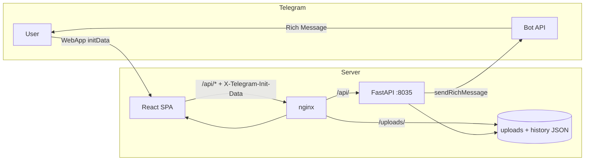

# Architecture

## Overview

Rich Posts is a three-tier application: Telegram Mini App (React) → FastAPI backend → Telegram Bot API.



## Frontend

**Entry:** `frontend/src/main.tsx` → `App.tsx` → `RichPostsPage.tsx`

### Key modules

| Module | Role |
|--------|------|
| `data/richPostModel.ts` | Block types, editor state, localStorage drafts |
| `utils/richBlocksToMarkdown.ts` | Blocks → Rich Message markdown |
| `utils/uploadMedia.ts` | Multipart upload to backend |
| `components/RichPostComposer.tsx` | Block editor UI |
| `components/TelegramRichPreview.tsx` | Client-side preview |
| `components/RichMessagePreview.tsx` | Preview from Bot API response blocks |
| `hooks/useTelegram.ts` | WebApp SDK wrapper |
| `lib/api.ts` | API base URL resolution |

### Editor flow

1. User edits blocks in composer
2. `richBlocksToMarkdown()` serializes to Rich Message markdown
3. **Preview:** `POST /draft` → bot sends real Rich Message to user's DM
4. **Publish:** `POST /send` with `mode=publish` → channel via bot token
   - Server verifies user is channel admin before send
   - Bot must also be channel admin (Telegram requirement)
5. Response includes parsed `blocks` from Telegram for accurate preview update

### Local storage

- Draft blocks and inline buttons persisted in `localStorage`
- Channel username cached per device
- History fetched from server (not localStorage)

### Browser gate

`index.html` blocks access outside Telegram (no valid `initData` → gate screen).

## Backend

**Entry:** `backend/run.py` → `app/main.py`

### Modules

| Module | Role |
|--------|------|
| `rich_posts.py` | Core API: meta, upload, draft, send, history |
| `auth.py` | initData HMAC validation |
| `security.py` | Rate limit, security headers, audit log |
| `storage.py` | JSON history, upload cleanup, quota |
| `telegram_webhook.py` | `/start` handler, webhook setup |
| `telegram_client.py` | httpx wrapper for Bot API |
| `config.py` | Environment settings |

### Upload pipeline

```
Client multipart → magic bytes check → quota check
  → (voice/webm) ffmpeg → OGG
  → save to isolated per-user upload storage
  → return HTTPS public URL
```

After publish, URLs in history are stripped and files deleted.

### Voice conversion

Telegram Rich Messages require voice as OGG/Opus. Browser recordings are WebM.

Resolution order for ffmpeg:

1. `FFMPEG_PATH` env
2. `backend/bin/ffmpeg` (optional bundled binary)
3. `ffmpeg` on system PATH

## Data storage

No database. File-based:

```
backend/
├── uploads/          # temporary media (per-user, auto-cleaned)
└── data/history/     # publication history JSON
```

History entries contain sanitized blocks (upload URLs cleared).

## Telegram integration

### Methods used

- `getMe` — bot username for UI
- `sendRichMessage` — preview and publish
- `deleteMessage` — replace previous preview in DM
- `setWebhook`, `setChatMenuButton`, `setMyCommands` — startup

### Rich Message markdown

Frontend generates markdown compatible with [Bot API Rich Messages](https://core.telegram.org/bots/api#richmessage):

- Headings `#`–`######`
- Bold, italic, underline, strikethrough, spoiler, code, highlight
- Lists, tables, blockquotes, code blocks, math
- Media tags for photo/video/audio/voice/animation
- Collage, slideshow, map blocks
- Inline keyboard via separate `reply_markup` field

## Security layers

1. **Telegram initData** — cryptographic auth on every API call
2. **Channel publish** — server verifies user is channel administrator
3. **nginx** — TLS, rate limits, method restrictions
4. **FastAPI middleware** — CORS, TrustedHost, rate limits, security headers
5. **Upload validation** — size, quota, content checks
6. **Webhook secret** — mandatory server-side configuration
7. **Content guards** — blocked patterns that crash Telegram Desktop clients

## Scaling considerations

Current design targets single-server deployment:

- In-memory rate limiter (not shared across workers)
- File-based storage (no horizontal sync)
- Single uvicorn process recommended

For multi-instance deployment you'd need Redis rate limiting and shared/object storage for uploads.
